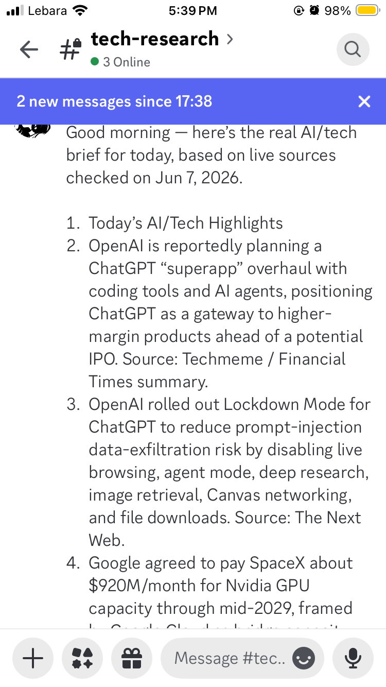
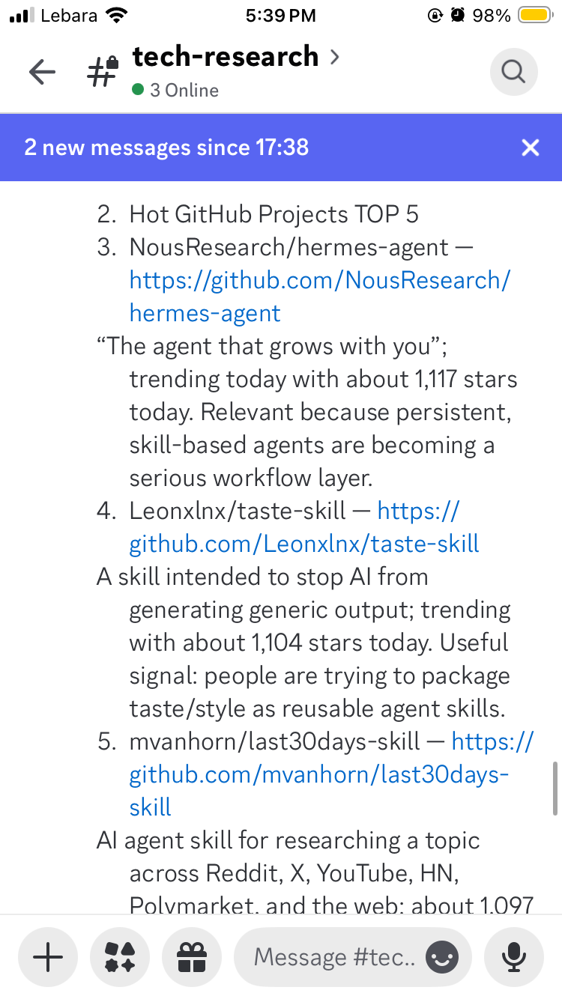

# daily-ai-tech-discord-briefing

A Hermes Agent skill that sends a daily AI/tech briefing to a Discord channel — fully unattended, every morning at 6 AM.

I wake up to this every morning in my `#tech-research` Discord channel:

<p>
  
  
</p>

## What it delivers

The briefing covers, in a fixed scannable format:

1. **Today's AI/Tech Highlights** — cross-checked from Techmeme, Google News, and official sources
2. **Hot GitHub Projects TOP 5** — filtered from GitHub Trending toward AI agents, dev tooling, and infra
3. **Practical Takeaways** — what it means for builders
4. **One-Line Opinion**

## Install

```bash
mkdir -p ~/.hermes/skills/research/daily-ai-tech-discord-briefing
curl -o ~/.hermes/skills/research/daily-ai-tech-discord-briefing/SKILL.md \
  https://raw.githubusercontent.com/loydkim/ai-skills/main/hermes/daily-ai-tech-discord-briefing/SKILL.md
```

Then in a new Hermes session:

```text
Load the daily-ai-tech-discord-briefing skill and create a daily 6 AM cron job
that sends the briefing to my Discord #tech-research channel.
```

## Prerequisites

- Hermes Agent installed and configured
- Discord gateway connected
- A Discord channel for delivery (e.g. `#tech-research`)
- Toolsets enabled: `web`, `browser`, `terminal`, `skills`

## Full documentation

Setup options (CLI and session-based), cron configuration, Discord troubleshooting, common pitfalls, and a verification checklist: **[SKILL.md](SKILL.md)**
